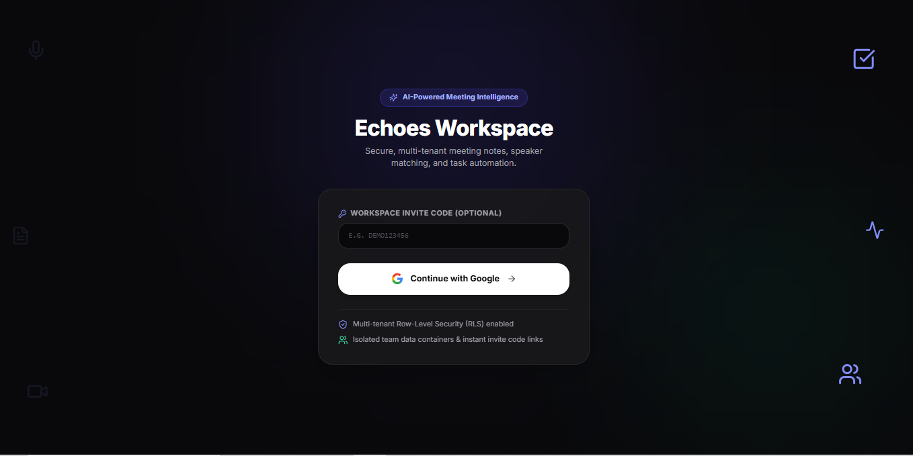
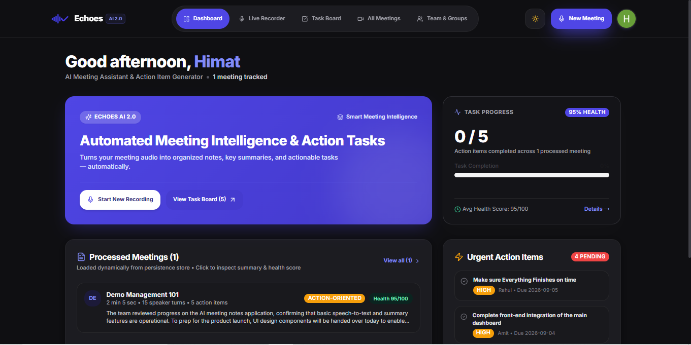
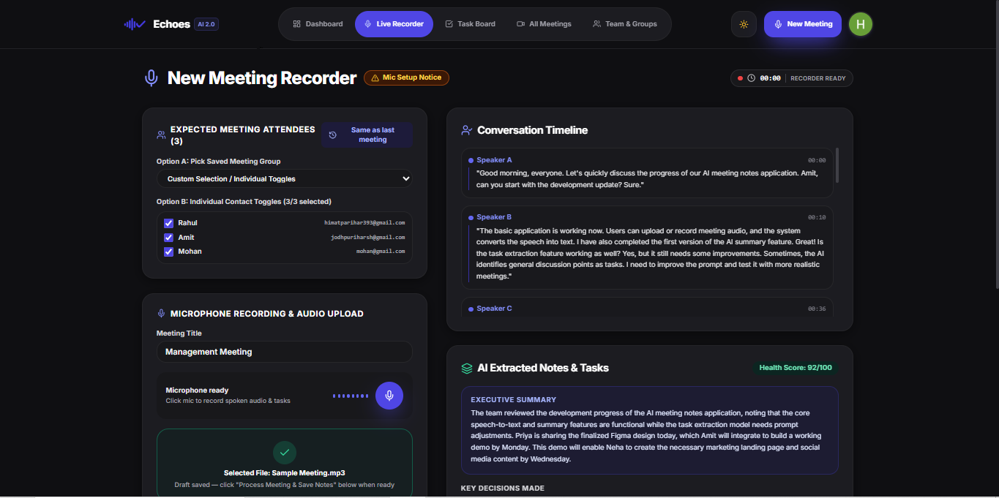
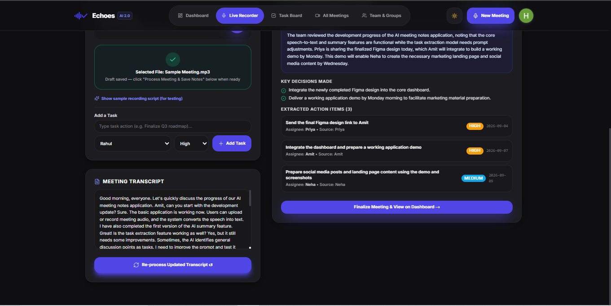
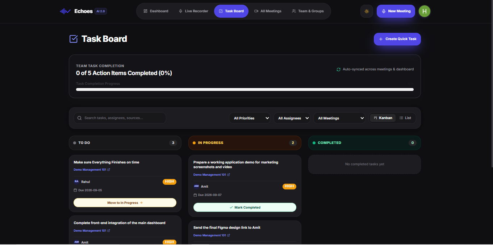
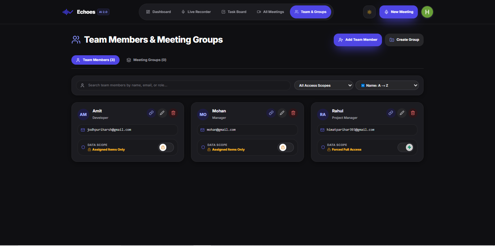

# Echoes — AI-Powered Meeting Notes & Task Generator

Echoes transforms live and uploaded meeting audio into structured notes, speaker-attributed transcripts, actionable tasks, and real-time meeting health metrics. Built with Next.js 14, Supabase, Google Gemini, and AssemblyAI, Echoes bridges the gap between raw conversation and actionable team execution with enterprise-grade multi-tenant workspace security.

---

## Overview

Echoes addresses meeting fatigue and lost action items by automatically capturing conversations, performing multi-speaker diarization, and extracting intelligence with generative AI. Meetings are converted into structured summaries, key decisions, prioritized tasks, sentiment analysis, and a dynamic Meeting Health Score. Users can export results directly to PDF or DOCX, synchronize action items to Google Calendar, dispatch automated email digests to team members, and manage tasks across organizations in a Kanban workspace with role-based and data-scope-restricted access control.

---

## Key Features

- **Live & Uploaded Audio Processing**: Record directly in-browser or upload meeting audio files (`.mp3`, `.wav`, `.m4a`, `.webm`) with background audio compression and progress tracking.
- **Speaker Diarization**: Automatic speaker identification and timestamped transcript segmentation powered by AssemblyAI.
- **AI Structured Extraction**: Automated generation of concise summaries, key decisions, action items, and sentiment analysis using Google Gemini.
- **Dynamic Meeting Health Score**: Evaluates engagement, clarity, actionability, and tone to assign a weighted 0–100 quality rating.
- **Multi-Tenant Organizations & Workspace Access**: Instant workspace switching, organization creation, and invite-code onboarding backed by Supabase Auth and Row Level Security (RLS).
- **Granular Data Scope & Restricted Member Portal**:
  - **Default "Assigned Items Only"**: Newly added team members default to restricted scope (`assigned_only`), ensuring they only access meetings and tasks assigned to them.
  - **Workspace Owner Controls**: Fluid toggle controls allow owners to grant `Full Workspace Access` or restrict to `Assigned Items Only`.
  - **Direct Address Bar Protection**: Restricted teammates navigating via URL are automatically routed to a dedicated Member Portal.
  - **Access Revocation & Teammate Retention**: Revoking access severs active workspace login permissions immediately while safely retaining historical team profiles in the directory.
- **Search, Filter & Sorting Controls**:
  - **Meetings Directory**: Real-time title search, status filters (`All`, `Completed`, `Draft`, `Uploaded`), and sorting (by Date, Title, Health Score, and Action Item Count).
  - **Team Directory**: Filter members by access scope (`Full Access`, `Assigned Items Only`) and sort alphabetically, by role, or by join date.
- **Interactive Kanban Task Board**: Filter, update, and manage action items with real-time velocity metrics across meetings.
- **Export Capabilities**: Clean, professional PDF generation (`pdf-lib`) and editable Microsoft Word (`docx`) document exports.
- **Google Calendar Synchronization**: One-click Google OAuth calendar event creation with direct meeting deep-links.
- **Automated Email Digests**: Per-member email digests with individual task previews delivered via Nodemailer / Gmail SMTP.
- **Two-Stage Brand & Refresh Loaders**:
  - **Initial Launch Splash Screen**: Letter-by-letter animated typography reveal with ambient background product highlights.
  - **In-App Refresh Halo Ring**: Textless minimalist Eclipse Ring loader that eliminates UI flickers while workspace permissions resolve atomically.
- **Multi-Language Support**: Support for English, Hindi, and Gujarati transcription and translation workflows.
- **Dark & Light Mode**: Accessible dark and light themes built with Vanilla CSS design tokens and Tailwind utilities.

---

## Tech Stack

| Layer | Technologies |
| :--- | :--- |
| **Frontend Framework** | Next.js 14 (App Router), React 18, TypeScript |
| **Styling & Motion** | Tailwind CSS, Vanilla CSS Design Tokens, Framer Motion |
| **Backend & Storage** | Supabase (PostgreSQL, Supabase Auth, Storage) |
| **AI & Diarization** | Google Gemini API (`@google/generative-ai`), AssemblyAI API |
| **Integrations** | Google Calendar API (OAuth 2.0), Nodemailer (Gmail SMTP) |
| **Document Generation** | `pdf-lib`, `docx` |
| **Deployment** | Vercel Platform |

---

## Getting Started

### Prerequisites

- **Node.js**: v18.0.0 or higher
- **Package Manager**: `npm` (v9+) or `yarn` / `pnpm`
- **Supabase Project**: A configured Supabase project with database & authentication enabled

### Installation

1. **Clone the repository**:
   ```bash
   git clone https://github.com/himatp/Echoes-AI.git
   cd Echoes-AI
   ```

2. **Install dependencies**:
   ```bash
   npm install
   ```

3. **Configure Environment Variables**:
   Create a `.env.local` file in the root directory and define the following variables:

   ```env
   # Supabase Configuration
   NEXT_PUBLIC_SUPABASE_URL=your_supabase_project_url
   NEXT_PUBLIC_SUPABASE_ANON_KEY=your_supabase_anon_key

   # Application URL
   NEXT_PUBLIC_APP_URL=http://localhost:3000

   # AI Service Credentials
   GEMINI_API_KEY=your_gemini_api_key
   ASSEMBLYAI_API_KEY=your_assemblyai_api_key

   # Google Calendar OAuth Credentials
   GOOGLE_CLIENT_ID=your_google_client_id
   GOOGLE_CLIENT_SECRET=your_google_client_secret

   # Email Service (Nodemailer / Gmail SMTP & Resend Fallback)
   GMAIL_USER=your_gmail_address
   GMAIL_APP_PASSWORD=your_gmail_app_password
   RESEND_API_KEY=your_resend_api_key
   ```

4. **Apply Database Migrations (Supabase SQL Editor or CLI)**:
   Execute the migration scripts located in `supabase/migrations/` sequentially in your Supabase SQL Editor to establish tables, RLS policies, storage buckets, and RPC helper functions:
   - `20260825_multi_tenant_schema.sql`
   - `20260828_storage_buckets.sql`
   - `20260829_meeting_status_and_audio.sql`
   - `20260831_data_visibility_rls.sql`
   - `20260831_org_members_rls_policies.sql`
   - `20260831_team_members_data_scope.sql`
   - `20260902_org_deletion_function.sql`
   - `20260903_alter_org_members_default_data_scope.sql`

5. **Run the Development Server**:
   ```bash
   npm run dev
   ```

6. Open [http://localhost:3000](http://localhost:3000) in your browser.

---

## Project Structure

```
├── public/                # Static assets, branding logo, favicons
├── src/
│   ├── app/               # Next.js App Router routes & API endpoints
│   │   ├── api/           # Serverless API routes (AI, audio, calendar, email, export)
│   │   ├── auth/          # Supabase Auth callback handler
│   │   ├── invite/        # Per-person invite landing & onboarding flow
│   │   ├── login/         # Google OAuth & invite-code sign-in page
│   │   ├── meetings/      # Meeting directory & detail view
│   │   ├── new-meeting/   # Audio recording & AI processing pipeline
│   │   ├── tasks/         # Kanban board view
│   │   └── team/          # Team members & meeting groups directory
│   ├── components/        # UI components, layout headers, modals, cards
│   │   ├── auth/          # Auth modals (Invite, Create Org, Join Org, AuthProvider)
│   │   ├── layout/        # Navbar with workspace switcher & theme toggle
│   │   ├── portal/        # MemberPortalView for restricted team members
│   │   └── ui/            # Reusable UI primitives, LogoLoader, AmbientIcons
│   ├── context/           # React Theme & Workspace contexts
│   ├── lib/               # Supabase client, PDF/DOCX generators, AI helpers, teamStore
│   └── middleware.ts      # Auth protection & session refresh middleware
├── supabase/
│   └── migrations/        # PostgreSQL schemas, RLS policies, RPC functions
└── package.json
```

---

## Demo & Screenshots

- **Login**:
  

- **Dashboard & Velocity Overview**:
  

- **Meeting Processing & Diarization**:
  
  

- **Kanban Task Board**:
  

- **Restricted Member Portal**:
  

---

## Known Limitations

- **Row Level Security (RLS)**: Core tables enforce Supabase Auth and data scope policies; verify service role keys are never exposed on client bundles.
- **Google OAuth Consent**: Google Sign-In and Google Calendar consent screens currently reference the default Supabase project domain (`supabase.co`) rather than a custom branded domain.
- **Future Roadmap**: Production features such as automated error tracking (Sentry), API rate-limiting, and subscription billing tier logic are planned for future iterations.
